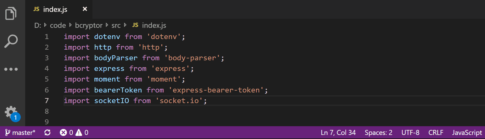

# updownreordering

Sort your lines up to down or vice versa as you want.

Very useful for import or declaration lines where you don't want a cardiogram, so keep a pretty and clean code.

## Features

* Ordering Up to Down.
* Ordering Down to Up.

You can use Order Down or Order Up commands from Status bar as shown below:

## Release Notes

This release make a review of the code and solve one issue (extra line added at end of selection).

### 1.0.0

Solved extra line issue.

### 0.0.1

Ordering works.

## Next Release

New logic for better sorting depending of selection type and improvement of extension ui/ux.

## Contributing

All Pull Requests are welcome.